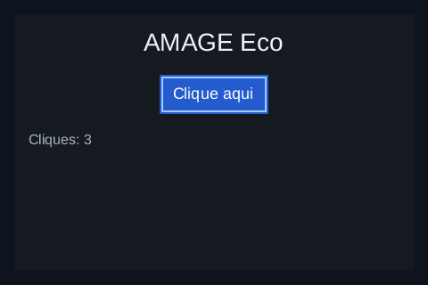
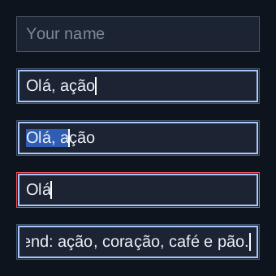
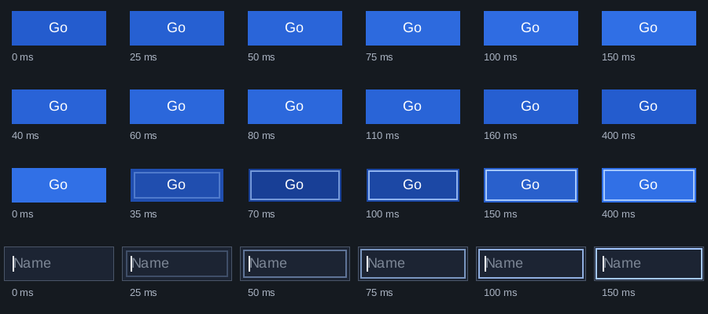

# Mokko

**Text, button, and text-field components for the AMAGE UI ecosystem, in Bend 2.**

Mokko turns controls into declarative draw primitives and semantics. A button
or a text label takes its bounds from [Tessra](https://github.com/amage-si/tessra),
its interaction state from [Kairo](https://github.com/amage-si/kairo), and text
measurements from the caller, and returns `Fill`, `Stroke`, and `TextRun`
primitives plus a `Semantic` record for accessibility. Mokko does not own a
window, a renderer, or a font rasterizer.

**Status:** early implementation, tested with **Bend 2.0.35** on Linux
(Hyprland with X11/XWayland). The first priority is a polished, reliable
experience on the development Linux machine. Compatibility layers will follow
proven progress.



The capture above is the counter demo in its own 480x320 window after a mouse
click, Space, and Enter: three activations, with the focus ring drawn inside
the button. Text is Liberation Sans, read by Runika, laid out by Syllo,
rasterized by Dithra, and composed by Chromi in an Ankra window.

## What works today

- `button`: label centered in its bounds, clipped, with normal, hover,
  pressed, and disabled fills and an inner focus ring. Size is the label
  measurement plus 32 x 20 logical units, at least 44 units tall.
- `text`: a single text run positioned from its measured ascent and clipped to
  its bounds.
- Kairo nodes for both (`button_node`, `text_node`) and the matching sizes for
  Tessra (`button_size`, `text_size`).
- `field`: a single-line editable text field (see below).
- Input validation: negative or non-finite metrics, an ascent above the height,
  invalid bounds, the wrong role, and font sizes outside `(0, 256]` are rejected.
- `Semantic{id, role, label, bounds, enabled, focused, pressed, actions}` for
  each control, with an `Activate` action on enabled buttons. Auvia publishes
  these over AT-SPI.
- `anim.bend`: animated transitions (see below).
- `demo.bend`: a pure counter model (title, button, status) laid out by Tessra
  from real Syllo measurements, updated by Kairo, that redraws only when needed.
- `visual.bend`: the window host for that model, using Ankra, Chromi, the text
  pipeline, and Kairo's event adapter.

### The text field



`field.bend` keeps one `Field` per field node. The host feeds it every Kairo
action (`TextDelivered`, `EditRequested`, `EditPointer`); editing rules come
from Kairo's `edit.bend`, and the field lays out every candidate text with
Syllo before committing it. It supports typing, selection with Shift and the
pointer (click and drag), word and edge motions, Backspace/Delete by cluster
or word, select all, copy, cut, and paste requests for the host's clipboard,
and horizontal scrolling that keeps the caret visible. Text Syllo or the
font cannot show is refused whole, never substituted or inserted in part:
the border turns to the error colour and the field keeps a message naming the
character, such as `Character U+2615 cannot be displayed`. Space and Enter
never activate a field. The image above was painted without a window by
`examples/field_render.bend`, with Chromi, Dithra, and Liberation Sans.

### Animated transitions



`anim.bend` animates the button and the field with
[Kinera](https://github.com/amage-si/kinera) springs and tweens and Chromi's
OKLab colour mixing. The host keeps a `ButtonAnim` or `FieldAnim` per control
and, per frame at time `now`, steps it with Kairo's state, draws with
`button`/`field_view`, and asks `button_deadline`/`field_deadline` when to
draw next; `None` means nothing moves, so idle needs no frames.

- The button fill fades between normal, hover and pressed colours in OKLab;
  a hover-out during the hover-in turns back from the current value and
  velocity, with no jump.
- A press darkens the fill and sinks it by 1 unit in 70 ms; release springs
  back.
- The focus ring of the button and the field fades in while it grows from
  6 to 2 units inside the bounds (150 ms); the field border fades to the
  error colour when an edit is refused.
- The caret holds solid for 500 ms after an edit, then blinks with 150 ms
  fades in a 1 s cycle, frames only during the fades; after ten cycles it
  stays solid. Blink is optional, and an unfocused window stops it.
- `Prefs.reduce` makes every transition instant and the caret solid.

A frame of the demo's button and field (steps, views, deadline) costs about
1.3 µs. The filmstrip above was painted without a window by
`examples/anim_render.bend`. The transitions are not yet in a window demo.

Verification on the development machine:

- **14 native checks** of primitives, state colors, text placement, focus,
  semantics, and invalid input (`tests.bend`).
- **5 checks with the real Liberation Sans font** (`demo_tests.bend`): a
  deterministic count of 2, a clean duplicate release, the updated label,
  focus semantics, and relayout from 480 to 180 units wide.
- **26 text-field checks with the real font** (`field_tests.bend`), driven
  through Kairo: typing, the refusal of `☕` with its message, a paste refused
  whole, a line break and the 257th character refused, copy and cut requests,
  a combining mark deleted with its base, a click hit, a drag selection, the
  primitive order, scrolling that keeps the caret visible (also after Home,
  End, a click on scrolled text, and deleting everything), and Space and
  Enter never activating the field.
- **22 transition checks** (`anim_tests.bend`, real font): the colour
  midway through a hover fade equals `mix_oklab` at Kinera's value, a
  mid-fade reversal keeps value, velocity and colour, deadlines stop once
  settled, reduce motion is instant, the press sink and release, the ring's
  inset and alpha, the caret blink cycle, its restart on typing, its stop
  (timeout, blink off, unfocused window), the border's OKLab fade, and the
  same primitive order as the static views.
- **Window run:** the final demo binary was driven once with 31 synthetic X11
  events sent only to its window, and all 31 arrived. It started at 0; a press
  dragged outside kept 0; a click gave 1; Tab showed the focus ring; Space with
  four autorepeat release/press pairs gave exactly 2 on release; Enter gave 3.
  Duplicate releases and moves without state change did not redraw. The window
  closed normally (exit 0). These were targeted synthetic events, not a manual
  test with a physical keyboard. See [docs/history.md](docs/history.md).

## Quick start

Requirements: the [Bend 2 toolchain](https://bend-lang.com), Clang 14 or newer,
and sibling repositories cloned side by side with their capitalized directory
names, because Bend imports are case-sensitive relative paths (`../Kairo/...`).

| Target | Siblings needed |
| --- | --- |
| `main.bend`, `tests.bend`, `examples/button.bend` | Tessra, Kairo |
| `demo.bend`, `demo_tests.bend`, `field.bend`, `field_tests.bend`, `examples/field*.bend` | + Syllo, Runika, Splina (Runika imports Splina) |
| `anim.bend`, `anim_tests.bend`, `examples/anim_bench.bend` | + Kinera, Chromi |
| `visual.bend` (window demo), `examples/field_render.bend`, `examples/anim_render.bend` | + Chromi, Dithra (and Ankra for the window) |

```sh
for repo in tessra kairo mokko; do
  git clone https://github.com/amage-si/$repo.git "${repo^}"
done
cd Mokko
export BEND_NO_TELEMETRY=1
bend version
mkdir -p build
bend tests.bend -o build/tests
./build/tests --threads 2 --gpu off
bend examples/button.bend -o build/button
./build/button --threads 2 --gpu off
```

The button example prints the primitives of one button before and after Kairo
moves focus to it:

```text
Idle:
  Fill [10, 20, 120x44] rgba=610062079
  TextRun "Count" at 45,32 baseline=47 clip=[18, 24, 104x36]
  semantic: id=1 label="Count" enabled
After Tab:
  Fill [10, 20, 120x44] rgba=610062079
  Stroke [12, 22, 116x40] width=2 rgba=2764636159
  TextRun "Count" at 45,32 baseline=47 clip=[18, 24, 104x36]
  semantic: id=1 label="Count" enabled focused
```

The font tests and the window demo also need Liberation Sans at
`/usr/share/fonts/liberation/LiberationSans-Regular.ttf` (Arch:
`ttf-liberation`; Debian/Ubuntu: `fonts-liberation`, which may install it under
a different directory). The font is read from the system and not included here.
The window demo needs an X11 display, directly or through XWayland.

```sh
for repo in syllo runika splina chromi dithra ankra; do
  git clone https://github.com/amage-si/$repo.git "../${repo^}"
done
bend demo_tests.bend -o build/demo_tests
./build/demo_tests --threads 2 --gpu off
bend visual.bend -o build/visual
./build/visual --threads 2 --gpu off
bend field_tests.bend -o build/field_tests
./build/field_tests --threads 2 --gpu off
bend examples/field.bend -o build/field
./build/field --threads 2 --gpu off
```

`examples/field.bend` replays a scripted session (typing, a refused `☕`, a
refused paste, Home, Shift+Ctrl+Right, copy, a drag, cut, paste) and prints
the field after every step and the final primitives.
`examples/field_render.bend` writes `build/field-render.ppm` (the image
above), and `examples/field_bench.bend` times `feed` and `view`.
`anim_tests.bend` checks the transitions, `examples/anim_render.bend` writes
the filmstrip to `build/anim-render.ppm`, and `examples/anim_bench.bend` times
a frame and prints how long each transition asks for frames.

Click the button, or use Tab, Space, and Enter. Close the window normally to
exit; it also closes after 18,000 polls.

## The component contract

```bend
button(node, state, metrics, font_size, theme) -> Result<&2, &2, String, View>
text(node, state, metrics, font_size, rgba)    -> Result<&2, &2, String, View>
View{primitives: +List<Primitive>, semantic: Semantic}

# field.bend
field(font, size, text)                         -> Result<&2, &2, String, Field>
feed(font, size, bounds, id, field, action)     -> Fed{field, dirty, request}
view(node, state, field, size, theme, placeholder) -> Result<&2, &2, String, FieldView>
FieldView{view: View, edit: EditState}

# anim.bend, per frame at `now`
button_step(anim, prefs, state, id, now)        -> ButtonAnim
field_step(anim, prefs, state, id, field, now)  -> FieldAnim
button(node, state, metrics, size, theme, anim, now) -> Result<&2, &2, String, View>
field_view(node, state, field, size, theme, placeholder, anim, prefs, now) -> Result<&2, &2, String, FieldView>
sooner(now, button_deadline(anim, now, frame_ms), field_deadline(anim, prefs, now, frame_ms)) -> Maybe<&2, U32>
```

Primitives are drawn in list order:

| Primitive | Meaning |
| --- | --- |
| `Fill{rect, rgba}` | Solid rectangle. |
| `Stroke{rect, width, rgba}` | Rectangle outline (the focus ring sits inside the bounds). |
| `TextRun{x, top, baseline, label, size, clip, rgba}` | Text whose layout starts at `(x, top)`; `baseline` is absolute. Apply `clip`. |

Colors are RGBA8 `0xRRGGBBAA`, straight alpha, sRGB channels; literals in the
code are decimal because the installed Bend parser does not accept hexadecimal.
Coordinates are logical units; the host owns the physical scale. The metrics
must be real measurements of that label at that size: Mokko validates their
range, not that they match the text. Read the [API reference](docs/api.md).

## Current boundaries

- Three components: text, button, and a single-line text field. No
  multi-line editing, scroll containers, composite layouts, or general text
  caches.
- The field accepts what Syllo lays out today and the font has a glyph for:
  printable ASCII, Latin-1 and its listed base + combining-mark pairs, Latin
  Extended, Greek, Cyrillic, typographic punctuation, currency signs (`€`) and
  common symbols, up to 256 scalars by default. Other characters (`☕`, emoji,
  Hebrew, Arabic, CJK, a currency sign the font lacks such as `₹`) are refused
  with a message. There is no IME
  preedit and no undo; the caret blinks only through `anim.bend`. Text reaches it only through Kairo's
  `TextInput`; the keyboard and clipboard come from the host.
- The field is not in a window demo yet: the counter window does not host
  it. It was checked with native tests, a scripted session, and an offline
  Chromi render, not on screen with a keyboard.
- The official runtime keeps a fixed window size and does not deliver resize,
  window focus, text input, or pointer leave. The model relayouts on `Resize`
  and is tested without a window, but real window resizing, window blur, and IME
  are not demonstrated.
- Kairo's dirty regions are precise, but the window demo rebuilds the whole
  image when something changes; partial repaint belongs to the renderer/host.
- Idle: the demo does not redraw without changes, but the official runtime
  still presents the retained image and polls at about 60 Hz. One 3 s sample
  measured 2.67% of a core. Redraws measured 1–2 ms without a counter change
  and 7–9 ms with one, on this machine. These are short local observations,
  not benchmarks or latency guarantees.
- Presentation is CPU/X11; no GPU claim.
- `Semantic` is data. Mokko itself contains no AT-SPI code; see
  [Auvia](https://github.com/amage-si/auvia) for the accessibility bridge.

The Bend checker and these tests are not a formal proof of the ecosystem.

## Repository map

| Path | Purpose |
| --- | --- |
| [main.bend](main.bend) | `Metrics`, primitives, `Semantic`, `Theme`, `button`, `text`, node and size helpers. |
| [demo.bend](demo.bend) | Pure counter model: `init`, `update`, `view`, with Tessra layout and Syllo measurements. |
| [visual.bend](visual.bend) | Window host for the counter: Ankra loop, Kairo adapter, Chromi drawing, cached text. |
| [chromi_text.bend](chromi_text.bend) | Text adapter for the host: Syllo layout, Dithra masks, Chromi blending. |
| [field.bend](field.bend) | The single-line text field: `field`, `feed`, `view`, node and size helpers. |
| [field_tests.bend](field_tests.bend) | Text-field checks with the real font; no display needed. |
| [anim.bend](anim.bend) | Animated transitions: `ButtonAnim`, `FieldAnim`, steps, animated views, deadlines. |
| [anim_tests.bend](anim_tests.bend) | Transition checks with the real font; no display needed. |
| [tests.bend](tests.bend) | Native component checks; no display or font needed. |
| [demo_tests.bend](demo_tests.bend) | Model checks with the real font; no display needed. |
| [examples/button.bend](examples/button.bend) | One button's primitives and semantics, idle and focused. |
| [examples/field.bend](examples/field.bend) | A scripted text-field session, printed step by step. |
| [examples/field_render.bend](examples/field_render.bend) | Five text-field states painted by Chromi to a PPM, without a window. |
| [examples/field_bench.bend](examples/field_bench.bend) | Times `feed` and `view` on a 256-scalar line. |
| [examples/anim_render.bend](examples/anim_render.bend) | The transitions filmstrip painted by Chromi to a PPM, without a window. |
| [examples/anim_bench.bend](examples/anim_bench.bend) | Times a frame of animated controls and how long each transition runs. |
| [docs/](docs/) | API reference and validation history. |

## Dependencies

Tessra and Kairo for the button and text; plus Syllo, Runika, and Splina for
the text field and the demo model; Kinera and Chromi's `mix.bend` for the
transitions; Chromi, Dithra, and Ankra for the window host; all beside Mokko. Also
the Bend 2 toolchain with its `Base` library, X11/XWayland for the window, and
the Liberation Sans font file. There is no hand-written native code and no
FreeType, HarfBuzz, Skia, GTK, or SDL.

[Auvia](https://github.com/amage-si/auvia) imports `../Mokko/main.bend`,
`../Mokko/demo.bend`, and `../Mokko/visual.bend`; keep those paths stable.

## Direction

Next: the text field in a window with Ankra's text input and clipboard,
scrolling, composite layouts, shared text caches,
partial repaint, and more components driven by real use. These are goals, not
supported features.

See [CONTRIBUTING.md](CONTRIBUTING.md) for development rules. The API is
experimental and may change. Licensed under either of [Apache License 2.0](LICENSE-APACHE) or [MIT](LICENSE-MIT), at your option.

## License

Licensed under either of

- Apache License, Version 2.0 ([LICENSE-APACHE](LICENSE-APACHE))
- MIT license ([LICENSE-MIT](LICENSE-MIT))

at your option. Unless you explicitly state otherwise, any contribution
intentionally submitted for inclusion in this work, as defined in the
Apache-2.0 license, shall be dual licensed as above, without any additional
terms or conditions.
